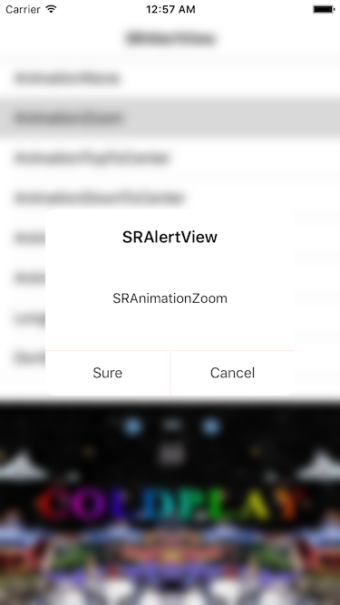
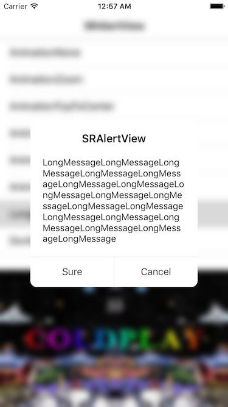
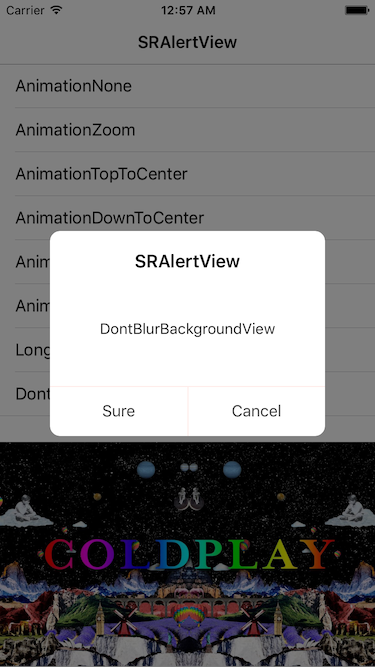

# SRAlertView

## Features

* At least one, and at most two actions.
* Bluring the current background view by default with FXBlurView.
* According to the length of message automatically adjust the height of alert view.

***

* 至少一个, 最多两个 action.
* 默认使用 FXBlurView 模糊当前背景视图.
* 根据 message 的长度自动调整 alert 视图的高度.

## Show




---




## Installation

### CocoaPods
> Add **pod ‘SRAlertView’** to the Podfile, then run **pod install** in the terminal.

### Manual
> Drag the **SRAlertView** folder to the project.(Note: if the project has already import FXBlurView, you should remove it which in the SRAlertView folder)

## Usage

````objc
// Just one action
[SRAlertView sr_showAlertViewWithTitle:@"SRAlertView"
                               message:@"SRAnimationNone"
                       leftActionTitle:@"Sure"
                      rightActionTitle:nil
                        animationStyle:AlertViewAnimationNone
                          selectAction:^(AlertViewActionType actionType) {
                              NSLog(@"%zd", actionType);
                          }];

// Most two action
[SRAlertView sr_showAlertViewWithTitle:@"SRAlertView"
                               message:@"SRAnimationZoom"
                          leftBtnTitle:@"Sure"
                         rightBtnTitle:@"Cancel"
                        animationStyle:AlertViewAnimationZoom
                         clickBtnBlock:^(AlertViewBtnType btnType) {
                             NSLog(@"%zd", btnType);
                         }];

// Long message             
NSString *message = @"LongMessageLongMessageLongMessageLongMessageLongMessageLongMessageLongMessageLongMessageLongMessageLongMessageLongMessageLongMessageLongMessageLongMessageLongMessageLongMessageLongMessageLongMessage";
[SRAlertView sr_showAlertViewWithTitle:@"SRAlertView"
                               message:message
                       leftActionTitle:@"Sure"
                      rightActionTitle:@"Cancel"
                        animationStyle:AlertViewAnimationZoom
                              delegate:self];

// Cancel bluring the current background view
SRAlertView *alertView = [[SRAlertView alloc] initWithTitle:@"SRAlertView"
                                                    message:@"DontBlurBackgroundView"
                                            leftActionTitle:@"Sure"
                                           rightActionTitle:@"Cancel"
                                             animationStyle:AlertViewAnimationZoom
                                              delegate:self];
alertView.blurCurrentBackgroundView = NO;
[alertView show];

// Delegate method
- (void)alertViewDidSelectAction:(AlertViewActionType)actionType {

    NSLog(@"%zd", actionType);
}
````

## Custom

````objc
/**
 The Animation style to show alert.
 */
@property (nonatomic, assign) AlertViewAnimationStyle animationStyle;

/**
 Whether blur the current background view, default is YES.
 */
@property (nonatomic, assign) BOOL blurCurrentBackgroundView;

/**
 Button's title color when highlighted.
 */
@property (nonatomic, strong) UIColor *buttonWhenHighlightedTitleColor;

/**
 Button's background color when highlighted.
 */
@property (nonatomic, strong) UIColor *buttonWhenHighlightedBackgroundColor;
````

**If you have any question, submit an issue or contact me.**   
**If this repo helps you, please give it a star.**  
**Have Fun.**
